# Getting a LUSEC Desktop project.

*Observera! För att göra ändringar i ett befintligt LUSEC Desktop-projekt, vänligen kontakta servicecenter@lu.se.*

Utgångspunkten för att beställa ett LUSEC Desktop-projekt är densamma som vid beställning av en forskningsdatamapp (https://www.staff.lu.se/get-started-research-data-folders). Skillnaden mellan de två uppstår när du väljer säkerhetsnivå för den data som ska lagras (https://www.staff.lu.se/research-and-education/research-support/support-research-process/research-data-management/protected-research-data).

Om du väljer nivå 1 eller 2 fortsätter processen som en beställning av en forskningsdatamapp. **Om du väljer nivå 3 eller 4** fortsätter processen med att skapa ett LUSEC Desktop-projekt.

*Note! To make changes to an existing LUSEC Desktop project, please contact servicecenter@lu.se.*

# Ordering a new LUSEC Desktop project.

The starting point for ordering a LUSEC Desktop project is the same when ordering a Research Data Folder (https://www.staff.lu.se/get-started-research-data-folders).  The distinction between the two happens when you choose a security level for the data that you will be storing (https://www.staff.lu.se/research-and-education/research-support/support-research-process/research-data-management/protected-research-data).

Choosing Level 1 or 2 will continue into the process for ordering a research data folder. **Choosing 3 or 4** will continue into the process for creating a LUSEC Desktop project.

# För att beställa ett nytt LUSEC Desktop-projekt

Följande instruktioner beskriver processen för att beställa ett nytt LUSEC Desktop-projekt.

# To order a new LUSEC Desktop project

The following instructions will detail the process of ordering a new LUSEC Desktop project.

## Grundläggande förutsättningar för att kunna beställa forskningsdatamappar

För att beställa ett LUSEC Desktop-projekt måste du ha ett LUCAT-konto. Se till att du har stark autentisering med Freja+ kopplad till ditt LU-konto och att du är ansluten till VPN om du inte är ansluten till universitetets gemensamma nätverk på plats.

## Basic requirements for ordering LUSEC Desktop

To order a LUSEC Desktop project, you must have a LUCAT account. Make sure you have strong authentication with Freja+ linked to your LU account and that you are connected to the VPN if you are not connected to the shared university network on site. 

### 1\. Logga in på [LUCAT](https://lucatv3.lu.se/)
### 1\. Log in to [LUCAT](https://lucatv3.lu.se/)

Klicka på rutan märkt ”MODUL FÖR BESTÄLLNING AV LAGRINGSYTOR” till höger.

On the righthandside click the box under 'MODULE FOR ORDERING STORAGE SPACES'

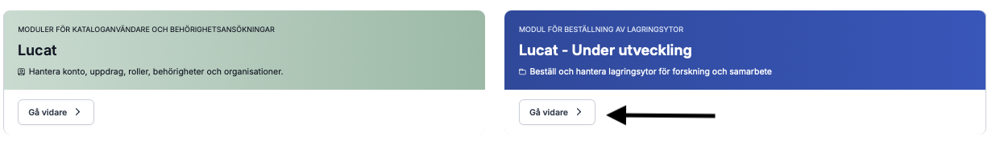

### 2\. Klicka på rutan märkt ”Forskningsprojekt/studier”.
### 2\. Click on the box labelled Research project/studies

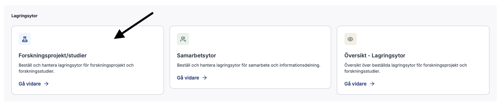

### 3\. Klicka på ”Lägg till projekt/studie” uppe till höger.
### 3\. In the top-right, click "Add project/study"

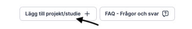

En dialogruta visas.

A dialogue box will appear.

### 4\. Fyll i projektuppgifterna
### 4\. Fill in the project details

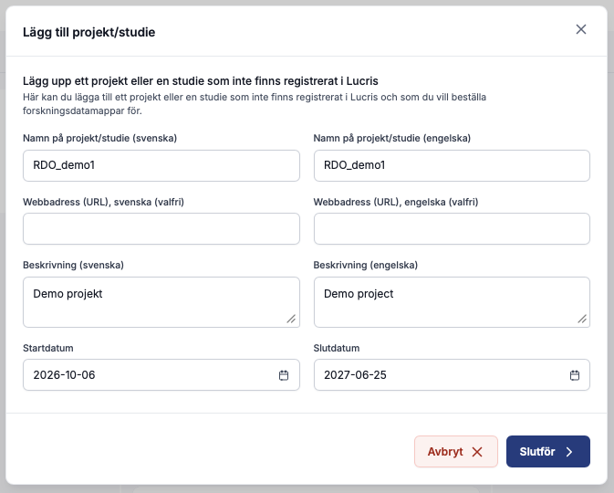

Ange projektets namn, en webbadress till projektet (om du har en), en kort beskrivning (valfritt) samt start- och slutdatum. Klicka sedan på "Slutför".

Name the project, provide a web address to the project (if you have one), a short description (optional), and a start and stop date. Then click on "Complete".

Projektet kommer att läggas till på huvudsidan under kolumnen "Ej lagring”.

The project will be added to the main page under the "No storage column". 

### 5\. Markera kryssrutan och klicka sedan på ”Beställ lagring”.
### 5\. Click the checkbox, and then "Order storage"

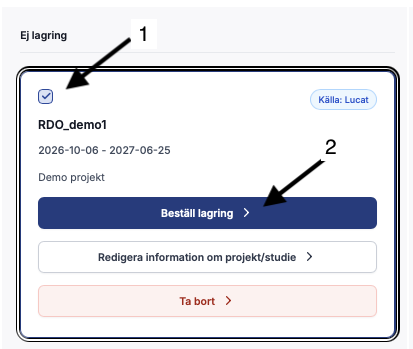

En dialogruta visas som talar om vilken information du behöver ha till hands, samt att du behöver Freja som e-legitimation. Klicka på "Påbörja beställing"

A dialogue box will appear telling you what information you will need beforehand, and that you need Freja as you e-ServiceID. Click on "Start order".

### 6\. Välj säkerhetsnivå
### 6\. Choose security level

Välj den [säkerhetsnivå](https://www.staff.lu.se/research-and-education/research-support/support-research-process/research-data-management/protected-research-data) som är lämplig för den data du ska lagra. Om du väljer 1 eller 2 går du vidare till processen för att beställa ett forskningsdataprojekt. **Om du väljer 3 eller 4 går du vidare till processen för att beställa ett LUSEC Desktop.** Eftersom du ansöker om ett LUSEC-projekt ska du välja 3 eller 4 och sedan klicka på ”Nästa steg” längst ner till höger.

Choose the [security level](https://www.staff.lu.se/research-and-education/research-support/support-research-process/research-data-management/protected-research-data) appropriate for the data you will be storing. Choose 1 or 2 will proceed into the process for ordering a research data project. **Choosing 3 or 4 will continue into the process for ordering a LUSEC Desktop**. As you are applying for a LUSEC project, choose 3 or 4 as appropriate, and then click on "Next step" in the bottom-right.

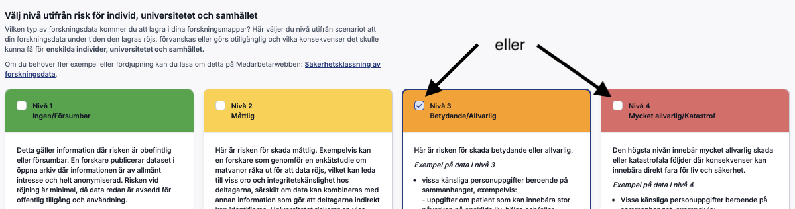

### 7\. Läs villkoren
### 7\. Read the terms and conditions

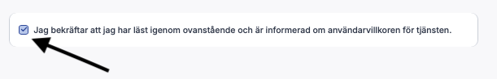

Markera kryssrutan för att bekräfta att du har läst och förstått dem. Klicka på ”Nästa steg”.

Click on the checkbox to confirm you have read and understood them. Click on "Next step"

### 8\. Namn på projektmapp, volym och kostnadsställe.
### 8\. Project folder name, volume, and cost center.

Ange ett kort namn för mappen (högst 10 tecken) och därefter den kostnadsställeansvariga för projektet. Ange sedan hur mycket lagringsutrymme du behöver. Klicka på ”Nästa steg” längst ner till höger för att fortsätta.

Enter a short name for the folder name (max 10 characters), and then the cost center responsible for this project. The enter how much storage you need. Click on "Next step" in the bottom-right to continue.

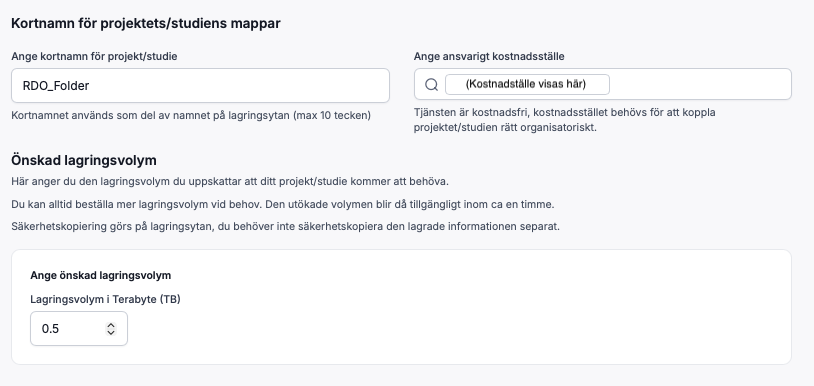

### 9\. Lägg till mappar
### 9\. Add folders

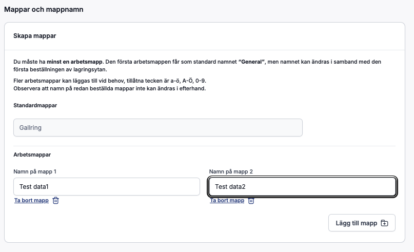

Lägg till de nödvändiga undermapparna i projektet genom att klicka på ”Lägg till mapp” och ge dem namn. Du kommer att ställa in behörigheter för dessa senare, det vill säga vem som har åtkomst och vilka läs- och skrivrättigheter som gäller.

”Gallring” är en obligatorisk mapp som används för arkivering. Den kan varken tas bort eller ändras.

Klicka på ”Nästa steg” när du är klar.

Add the required subfolders to the project by clicking on "Add folder" and name them. You will set permissions on these later, i.e who can access them, and what read/write permissions they have.

"Gallring" is a mandatory folder used for archving. It cannot be removed or changed.

Click "Next step" when done.

### \.
### 10\. Add members and set permissions

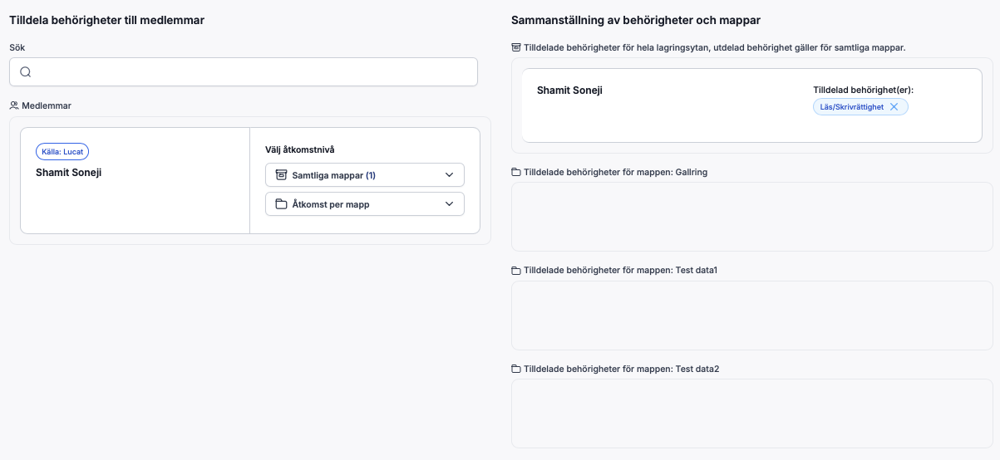

För tillfället är du den enda synliga användaren. För att lägga till fler personer i projektet söker du efter dem i rutan (1), markerar rutan vid personen du vill lägga till (2) och klickar sedan på ”Lägg till medlemmar” (3).

The only user visible at this time will be you. To add more people to the project, search for them in the box (1), check the box on the person you wish to add (2), and then click on "Add members" (3). 

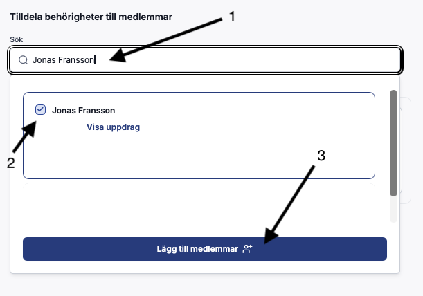

När du har lagt till alla personer visas de i en lista:

When you are finished adding people, you will see them listed:

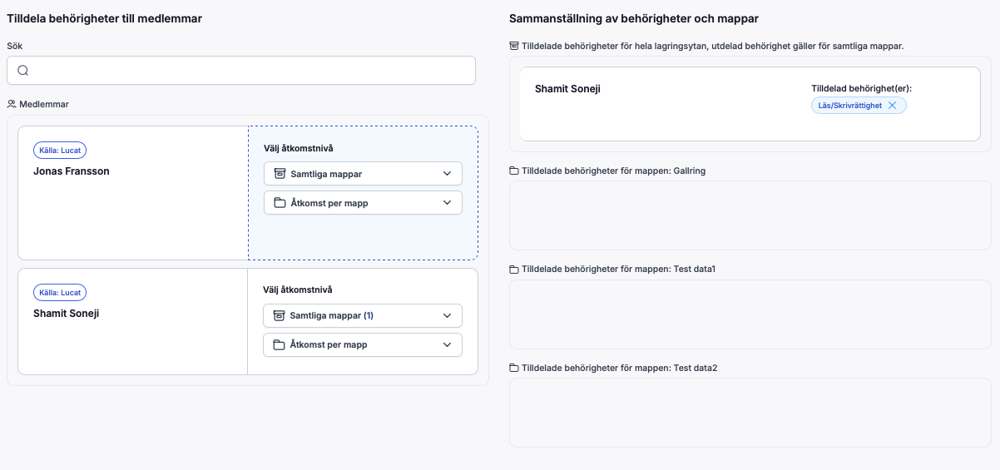

Du kan nu ange status och behörigheter för varje person i listan. Behörigheter på övergripande nivå ställs in i rullgardinsmenyn Samtliga mappar”:

You can now set the status and permissions of each person in the list. Top level permissions are set in the "All folders" dropdown box:

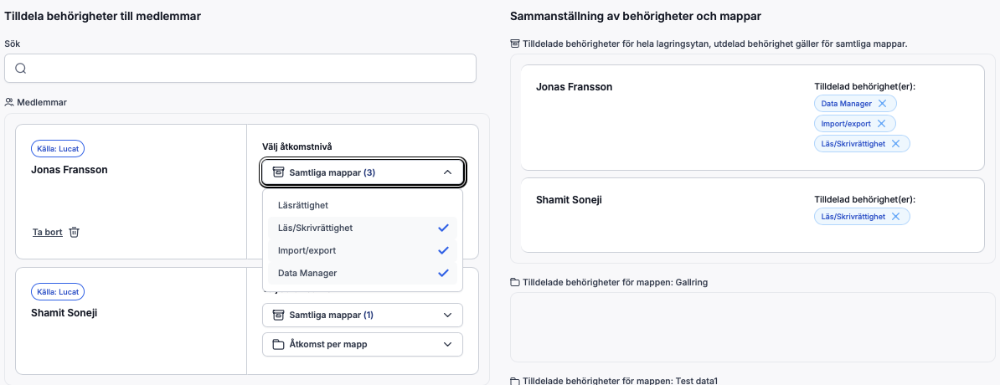

I det här exemplet har Jonas tilldelats läs- och skrivbehörighet till **alla** mappar samt behörighet att importera och exportera data till LUSEC via Sharefile. Han har även utsetts till dataansvarig (Data Manager), vilket innebär att han har rätt att hantera behörigheter, uppdatera information om projektet eller studien samt begära utökat lagringsutrymme vid behov. **Att utses till Data Manager eller Bitr.forskningsprojektledare innebär inte automatiskt att man har läs- och skrivbehörighet i hela projektet.** Behörigheterna måste fortfarande ställas in på lämpligt sätt.

In this example Jonas has been given read/write access to **all** folders, and has been given permission to import/export data into LUSEC using Sharefile. He has also been assigned as a Data Manager meaning he has the right to manage permissions, update project/study information and request increased storage volume if needed. **Being assigned as a Data Manager or Assistant PI does not mean you automatically have read7write access across the entire project**. Permissions still need to be set accordingly.

Behörigheter kan även tilldelas på enbart mappnivå.
Permissions can also be given just at the folder level.

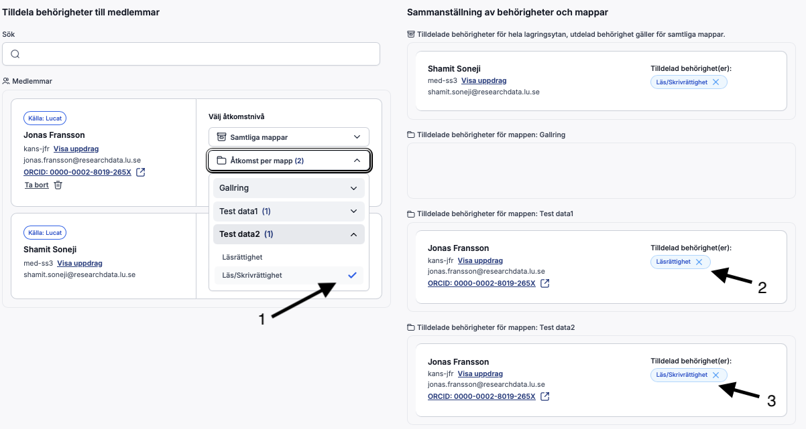

Behörigheter ställs in genom att markera rutan bredvid behörighetstypen (1). För mappen ”Test data1” har Jonas endast tilldelats läsbehörighet (2), men läs- och skrivbehörighet för ”Test data 2” (3).

Permissions are set by adding a checkmark next to the permission type (1). For folder "Test data1" Jonas has been given read permission only (2), but read-write permission on "Test data 2" (3).

När du är nöjd med hur behörigheterna har ställts in, klicka på ”Nästa steg”.

When you are satisfied with how permissions have been set, click on "Next step"

### 11\. Slutför beställning
### 11\. Complete request

Granska sammanfattningen av din beställning. Du kan gå tillbaka till varje enskilt steg om något behöver justeras. Klicka på ”Slutför begäran” och godkänn med Freya för att skicka in beställningen.

Review the summary of what you are ordering. You can go back to each individual step if anything needs to be adjusted Click "Complete request" and authorise using Freya to submit the order.

Din beställning kommer att behandlas, och du kommer att meddelas via e-post när din projektmapp är tillgänglig.

Your order will be processed, and you will be notified by email when your project folder is available.

